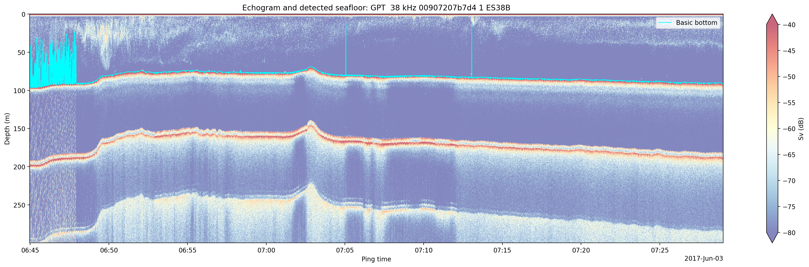

# NCEI_ES60

<p align="center">
  
</p>

<p align="center">
  Example 38 kHz ES60 echogram with automated seafloor detection.
</p>

## Overview

**NCEI_ES60** provides Python tools for organizing, validating, and processing Simrad **ES60** echosounder `.raw` data using the `echopype` library.

The package is designed to support cruise-level processing workflows for ES60 datasets, including navigation validation, cruise organization, bottom-depth extraction, and quality-control product generation.

The package is intended for processing historical and contemporary Simrad ES60 fisheries-acoustic datasets for navigation validation, bathymetric extraction, and cruise-level data management.

The current workflow is:

```text
CRUISES_raw/
    ↓
nav_checker
    ↓
CRUISES_processed/
    ↓
depth_extractor
    ↓
bottom-depth products
```

> **Note:** Although `echopype` uses the `"EK60"` sonar model designation, Simrad ES60 and EK60 systems share the same `.raw` file format and are processed identically by `echopype`.

---

## Current Modules

| Module | Purpose |
|----------|----------|
| `nav_checker.py` | Navigation validation and cruise organization |
| `depth_extractor.py` | Bottom-depth extraction and QC product generation |

---

## Example Notebooks

The repository includes example Jupyter notebooks demonstrating common workflows.

| Notebook | Description |
|-----------|-------------|
| `nav_checker_readonly.ipynb` | Audits a cruise directory in read-only mode and generates a navigation summary without moving or copying files. |
| `nav_checker_process.ipynb` | Processes a cruise directory and organizes files into the standard `CRUISES_processed` directory structure. |
| `process_depth_single.ipynb` | Extracts bottom depths from a single ES60 raw file within a processed cruise directory. Useful for testing settings and reviewing QC plots. |
| `process_depth_directory.ipynb` | Batch-processes all raw files in the `raw_w_nav` directory and generates cruise-level depth products. |

---

## Dependencies and Installation

### Install echopype

The recommended setup uses **Python 3.11** and installs `echopype` in development mode.

```bash
# Create and activate a conda environment
conda create --name echopype python=3.11
conda activate echopype

# Clone echopype
git clone https://github.com/OSOceanAcoustics/echopype.git
cd echopype

# Install in development mode
pip install -e ".[dev]"
```

#### echopype Resources

GitHub:

https://github.com/OSOceanAcoustics/echopype

Documentation:

https://echopype.readthedocs.io/

---

### Install NCEI_ES60

```bash
git clone https://github.com/ashtonflinders/NCEI_ES60.git
cd NCEI_ES60

pip install -e .
```

Additional dependencies may be installed with:

```bash
pip install numpy pandas matplotlib xarray
```

---

## nav_checker.py

### Summary

`nav_checker.py` evaluates the presence of usable navigation information within Simrad ES60 `.raw` files and optionally organizes datasets into a standardized cruise directory structure.

The module processes only **top-level `.raw` files** within a source directory. Navigation availability is determined using latitude/longitude information and, optionally, NMEA sentence metadata.

### Key Features

- Navigation validation using latitude and longitude.
- Optional use of NMEA sentence metadata.
- Read-only auditing mode.
- File move or copy workflows.
- Automatic cruise-directory organization.
- User-configurable summary CSV naming.
- Optional summary generation in read-only mode.
- Clean relative-path console output.
- Batch processing of entire cruise directories.

### Directory Categories

```text
raw_w_nav/
    Files containing usable navigation

raw_no_nav/
    Files lacking usable navigation

raw_error/
    Files that could not be processed

calibration/
    Calibration folders

other/
    Non-.raw files
```

---

### Typical Processing Workflow

```python
from pathlib import Path
from ncei_es60.nav_checker import NavCheckerConfig, process_cruise

config = NavCheckerConfig(
    source_dir=Path("../CRUISES_raw/EBS17VA_example"),
    read_only_mode=False,
    move_files=False,
    output_dir=Path("../CRUISES_processed/EBS17VA_example"),
    use_sentence_for_nav=True,
)

summary_df = process_cruise(config)
```

---

### Read-Only Navigation Audit

```python
from pathlib import Path
from ncei_es60.nav_checker import NavCheckerConfig, process_cruise

config = NavCheckerConfig(
    source_dir=Path("../CRUISES_raw/EBS17VA_example"),
    read_only_mode=True,
    use_sentence_for_nav=True,
    write_summary_in_read_only=True,
    read_only_summary_dir=Path("../CRUISES_nav_summaries"),
    summary_filename="{source_dir}_nav_summary.csv",
)

summary_df = process_cruise(config)
```

---

### Example Output Structure

```text
CRUISES_processed/
└── EBS17VA_example/
    ├── raw_w_nav/
    ├── raw_no_nav/
    ├── raw_error/
    ├── calibration/
    ├── other/
    └── raw_nav_summary.csv
```

---

## depth_extractor.py

### Summary

`depth_extractor.py` extracts bottom-depth picks from navigation-processed Simrad ES60 `.raw` files using `echopype`.

The module operates on a cruise directory produced by `nav_checker.py`, reads `.raw` files from `raw_w_nav`, performs bottom detection, and generates bottom-depth products and optional quality-control images.

The extracted bottom picks are intended for research and exploratory bathymetric applications and should not be considered hydrographic-grade soundings.

### Key Features

- Echopype basic bottom detector (default).
- Optional Blackwell bottom detector.
- Combined CSV output containing all frequencies and detection methods.
- Frequency-specific sound-speed export.
- Optional echogram QC images.
- Cruise-level error logging.
- Single-file or batch-cruise processing.
- Optional interactive plotting for diagnostics.

---

### Typical Processing Workflow

```python
from pathlib import Path
from ncei_es60.depth_extractor import (
    DepthExtractionConfig,
    process_cruise,
)

config = DepthExtractionConfig(
    cruise_dir=Path("../CRUISES_processed/EBS17VA_example"),
    single_raw_file=None,
    run_blackwell_detector=False,
    save_depth_images=True,
)

summary_df = process_cruise(config)
```

---

### Process a Single Raw File

```python
from pathlib import Path
from ncei_es60.depth_extractor import (
    DepthExtractionConfig,
    process_cruise,
)

config = DepthExtractionConfig(
    cruise_dir=Path("../CRUISES_processed/EBS17VA_example"),
    single_raw_file="L0004-D20170602-T224458-ES60.raw",
    run_blackwell_detector=False,
    save_depth_images=True,
    show_plots=True,
)

summary_df = process_cruise(config)
```

---

### Expected Cruise Structure

```text
CRUISES_processed/
└── EBS17VA_example/
    ├── raw_w_nav/
    │   └── *.raw
    │
    ├── depth/
    │   └── *_depth.csv
    │
    ├── images/
    │   └── *_bottom_detection.png
    │
    └── depth_processing_errors.txt
```

---

### Combined CSV Output

One CSV file is generated per input `.raw` file.

Example output columns:

```text
ping_time
latitude
longitude

38kHz_sound_speed_m_s
38kHz_basic
38kHz_blackwell

120kHz_sound_speed_m_s
120kHz_basic
120kHz_blackwell
```

### Output Precision

| Field | Precision |
|---------|---------|
| Latitude | 6 decimal places |
| Longitude | 6 decimal places |
| Depth | 2 decimal places |
| Sound Speed | 2 decimal places |

---

### Quality-Control Images

Optional echogram images are generated showing:

- Calibrated Sv echogram
- Basic bottom picks
- Blackwell bottom picks (if enabled)

Example filename:

```text
L0004-D20170602-T224458-ES60_38kHz_bottom_detection.png
```

---

## Repository Structure

```text
NCEI_ES60/
│
├── ncei_es60/
│   ├── __init__.py
│   ├── nav_checker.py
│   ├── depth_extractor.py
│   └── ...
│
├── notebooks/
│   ├── nav_checker_readonly.ipynb
│   ├── nav_checker_process.ipynb
│   ├── process_depth_single.ipynb
│   ├── process_depth_directory.ipynb
│   └── ...
│
├── CRUISES_raw/
│   └── EBS17VA_example/
│
├── CRUISES_processed/
│   └── EBS17VA_example/
│
├── CRUISES_nav_summaries/
│
├── notes/
│
├── pyproject.toml
├── README.md
├── LICENSE
└── .gitignore
```

---

## Example Workflow

### 1. Audit a cruise in read-only mode

```python
from pathlib import Path
from ncei_es60.nav_checker import NavCheckerConfig, process_cruise

config = NavCheckerConfig(
    source_dir=Path("../CRUISES_raw/EBS17VA_example"),
    read_only_mode=True,
)

summary_df = process_cruise(config)
```

### 2. Organize files into a processed cruise directory

```python
from pathlib import Path
from ncei_es60.nav_checker import NavCheckerConfig, process_cruise

config = NavCheckerConfig(
    source_dir=Path("../CRUISES_raw/EBS17VA_example"),
    read_only_mode=False,
    move_files=False,
    output_dir=Path("../CRUISES_processed/EBS17VA_example"),
)

summary_df = process_cruise(config)
```

### 3. Extract bottom depths

```python
from pathlib import Path
from ncei_es60.depth_extractor import (
    DepthExtractionConfig,
    process_cruise,
)

config = DepthExtractionConfig(
    cruise_dir=Path("../CRUISES_processed/EBS17VA_example"),
    run_blackwell_detector=True,
)

summary_df = process_cruise(config)
```

---

## Future Development

Planned enhancements include:

- ES60 calibration extraction and management tools.
- Triangular waveform artifact identification and removal.
- Multi-frequency and single-frequency bottom-detection post-processing to improve seafloor pick consistency and robustness.
- Bottom-detection uncertainty estimation and quality metrics for bathymetric applications.
- Automated cruise-level processing workflows.
- Multi-cruise batch processing support.

---

## Author

**Ashton Flinders**

andrealphus@gmail.com

---

## License

This project is released under the **MIT License**.

See the `LICENSE` file for details.
